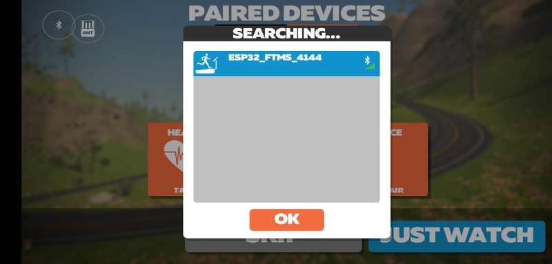
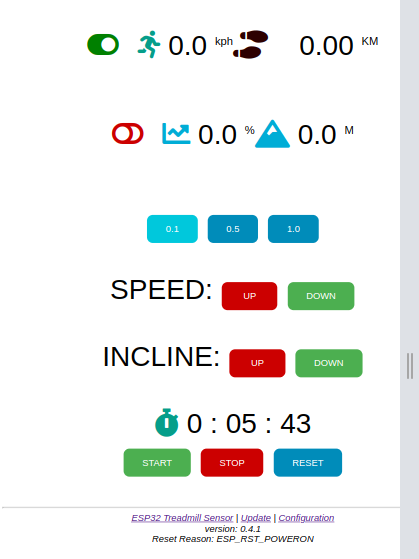
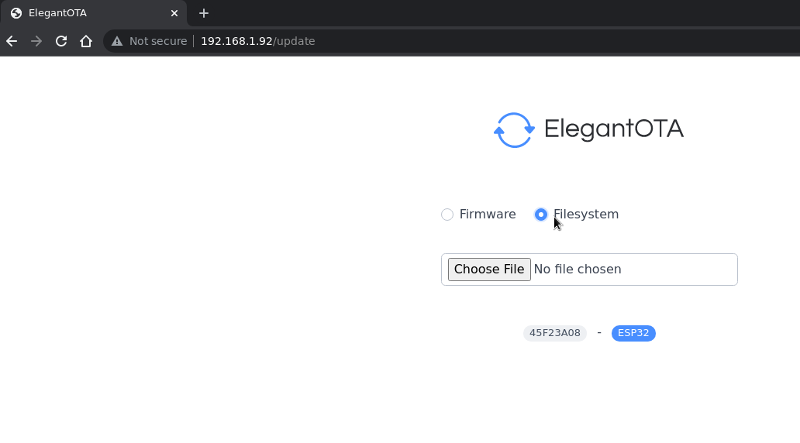

[](https://app.codacy.com/gh/lefty01/ESP32_TTGO_FTMS?utm_source=github.com&utm_medium=referral&utm_content=lefty01/ESP32_TTGO_FTMS&utm_campaign=Badge_Grade_Settings)
[](https://github.com/lefty01/ESP32_TTGO_FTMS/actions/workflows/platformio-ci.yml)
[](https://gitter.im/lefty01/ESP32_TTGO_FTMS?utm_source=badge&utm_medium=badge&utm_campaign=pr-badge&utm_content=badge)
[](https://www.paypal.com/donate/?hosted_button_id=TQGGMQ45T4QKJ)

# ESP32_TTGO_FTMS
ESP32 based treadmill speed and incline sensor and BLE Server exposed as FTMS Service

Based/Inspired on/by this project:

  * https://hackaday.io/project/175237-add-bluetooth-to-treadmill

and info and thoughts from this zwift forum post:

  * https://forums.zwift.com/t/show-us-your-zwift-setup/59647/19

## some random info (moved from code comments into Readme)

GAP  stands for Generic Access Profile

GATT stands for Generic Attribute Profile defines the format of the data exposed
by a BLE device. It also defines the procedures needed to access the data exposed by a device.

Characteristics: a Characteristic is always part of a Service and it represents
a piece of information/data that a Server wants to expose to a client. For example,
the Battery Level Characteristic represents the remaining power level of a battery
in a device which can be read by a Client.

Where a characteristic can be notified or indicated, a Client Characteristic Configuration
descriptor shall be included in that characteristic as required by the Core Specification

use Fitness Machine Service UUID: 0x1826 (server)
with Treadmill Data Characteristic 0x2acd

## Description
In the meantime this project basically consits of this software project (ESP32 firmware) as well as a hardware project
that has the goal to develop some solid PCB to hold one or the other ESP32 development boards.
The hardware project can be found here: https://oshwlab.com/zingo_1902/esp32_ttgo_display
This project is maintained by [zingo](https://github.com/zingo)

In the most common and most simple use-case you can either connect the treadmill reed-switch aka speed sensor to the ESP32 or connect two infrared sensors see [2] and put some markers on the treadmill belt.

Together with an MPU6050 [3] you will then be able to get speed and incline readings from the ESP32.

The ESP32 will act as BLE server and transmit this data. For example connect with the Zwift app (from Android or PC) to the ESP32. It should show up as a speed sensor, see below. The name is ESP32_FTMS_XXXX with XXXX being last part of the ESP32 device ID (I added that part since I sometimes had more than one board powered).



That's about it ... you might not need or want more. You could then even go without any tft screen and place the board into the motor room of your treadmill for example.

There are a few additional features however that I came up with during initial development and debug. 

For example there is an additional web interface.
And since I started with some spare TTGO-T-Display board you have TFT display support.
The display is used during init or setup of the board and displays some information about the system.
Later you will get speed, incline, total distance, and total elevation gain readings from the display.

While experimenting with sensor positions and sensor types I found it useful to override speed and incline values.
So this is still possible via a) the web-ui b) buttons on the ESP32 dev board or c) via touchscreen interface.
We call this speed/incline auto or manual mode.

With the development of the custom PCB we look further into ways to directly interface with the treadmill controls.
In this way you could run in manual mode but get the input from treadmill buttons or triggers instead of buttons on the ESP32.
Or, it could then as well be possible to turn things around and have the ESP32 control your treadmill speed and incline.
For example if we get the incline values while running on Zwift (ocr capture, sniff it, zwift future feature to send run incline in someway) then we can feed this value via the ESP32 back to the treadmill, sounds great but might take a while to get there.

If you go with the infrared sensor the this is the most treadmill-model-independant solution. Check the code at the moment the sensors need to be roughly 100mm apart.


## Parts Used
  * Treadmill Speed Sensor (Reed-Switch) [1]
  https://de.aliexpress.com/item/4000023371194.html?spm=a2g0s.9042311.0.0.556d4c4d8wMaUG

  * Infrared-Sensor (Obstacle Avoidance Sensor) [2]
  https://de.aliexpress.com/item/1005001285654366.html?spm=a2g0s.9042311.0.0.27424c4dPrwkYp

  * 3 Axis analog gyro sensors+ 3 Axis Accelerometer GY-521 MPU-6050 MPU6050 [3]
  https://de.aliexpress.com/item/32340949017.html?spm=a2g0s.9042311.0.0.27424c4dPrwkYp

  * WT32-SC01 [5]
  https://tinyurl.com/4kbp8fkf

  * Lilygo TTGO-T4 (ESP32 with 240x320 Display and SD-card slot, also feat. 5-pin JST con. for I2C) [6]

Reed switch is installed next to the original treadmill reed contact and connected via external pull-up.

## WIFI config
Rename the 

include/wifi_mqtt_creds.h.sample 

to 

include/wifi_mqtt_creds.h 

and edit it.

If you are using MQTT_USE_SSL you also need to rename/edit the following files:

include/server_mqtt.crt.h.sample
include/client.crt.h.sample
include/client.key.sample

## Filesystem

At this point the filesystem (files within the data folder) contain the files for the webinterface:
index.html  index.js  style.css

and config files

To build the LittleFS filesystem run:
```
$ pio run  -e ESP32_TTGO_DISPLAY -t buildfs 
```
You can then flash it over-the-air as well.

Also check the PlatformIO section below.

## arduino IDE settings
  * Board: ESP32 Dev Module
  * Partition: Huge App (no OTA 3MB/1MB SPIFFS)

# JSON serialize / deserialize
## calculate memory requirement
https://arduinojson.org/v6/assistant/

## serialize websocket data
```
{
  "speed": "22.00",
  "incline": "15.0",
  "speed_interval": "10.0",
  "sensor_mode": "0",
  "distance": "9999.99",
  "elevation": "9999.99",
  "hour": "00",
  "minute": "00",
  "second": "00"
}
```

## Web interface
This is how the website should look like.
At the top you see four values for (top-left to bottom-right): speed, distance, incline, elevation gain.
The two switch buttons clickable and will toggle between auto (green) aka. sensor reading mode
where speed and incline is measured via sensor or manual mode (red).
Manual mode means you override sensor readings by clicking the UP/DOWN buttons on the webinterface.



### OTA
Under the /update URL you can upload a new firmware image or spiffs filesystem image over-the-air.



# measurements via oscilloscope
```
km/h vs. Period ms
km/h 	 P ms
22	  40.8
20	  45.0
16	  56.0
12	  76.0
10	  90.4
 8	 112.8
 4	 225
 2	 450
 1	 900
 0.5	1840
```

From this we can also calculate an average distance the magnet travels on the motor wheel of 0.25088m -> 250mm (the circumference).

# Issues
IR-Sensor (here Sensor 1) is connected to GPIO12

GPIO36 interrupt, changed reed-sensor to GPIO26
https://github.com/espressif/esp-idf/issues/4585


# Treadmill models

we will switch to use the [wiki](https://github.com/lefty01/ESP32_TTGO_FTMS/wiki) to document treadmill models (specifications, features, how to connect to the ESP32 controller, ...)

The config which model is used happens by reading the treadmill.txt file wihtin the data littlefs filesystem.


## TAURUS 9.5
Define as **TAURUS_9_5**
### Specs
Min speed is 0.5km/h and Max speed is 22km/h, speed increments at 0.1km/h.
This model has 15 incline *Levels* which are not equal to a grade in percent. So grade ranges from 0% to about 11%.

You can attach a second reed switch [2] next to the original one (that's what I did).
Via a two-wire extension I now have a TTGO-T4 mounted to the main console (todo: add img).

I think it should be easily possibly to intercept speed and incline controls from the two trigger switches,
that would open up a bunch of new possible features (if zwift would send back incline, we could have auto-incline-mode).
In fact I was also thinking of using either an esp32-cam module or pi-zero to capture incline from a screen or monitor.

## NordicTrack T 12.2
Define as **NORDICTRACK_12SI**
```
// Northtrack 12.2 Si:
// Geschwindigkeit: 0.5 - 20 km/h (increments 0.1 km/h)
// Steigung:        0   - 12 %    (increments .5 %)
// On Northtrack 12.2 Si there is a connector between "computer" and lower buttons (Speed+/-, Start/Stop, Incline +/-) with all cables from
// motor controll board MC2100ELS-18w together with all 6 buttons (Speed+/-, Start/Stop, Incline +/-)
// This seem like a nice place to interface the unit. This might be true from many more treadmills from differnt brands from Icon Healt & Fitness Inc
//
// Speed:
// Connect Tach. e.g. the Green cable 5v from MC2100ELS-18w to pin SPEED_REED_SWITCH_PIN in TTGO T-Display with a levelshifter 5v->3v in between seem to work quite ok
// This should probably work on most many (all?) treadmills using the motor controll board MC2100ELS-18w from Icon Healt & Fitness Inc
//
// Incline:
// If no MPU6050 is used (e.g. if you place the esp32 in the computer unit and don't want to place a long cable down to treadmill band)
// Incline steps from the compuer can be read like this. 
// Incline up is on the Orange cable 5v about a 2s puls is visible on ech step. Many steps cause a longer pulse.
// Incline down is on the Yellow cable 5v about a 2s puls is visible on ech step. Many steps cause a longer pulse
// Incline seem to cause Violet cable to puls 3-4 times during each step, maye this can be used to keep beter cound that dividing with 2s on the above?
//
// Control
// As for controling the treadmill connecting the cables to GROUND for abour 200ms on the four Speed+, Speed-, Incline+ and Incline- cables from the buttons
// in the connector seem to do the trick. I don't expect Start/Stop to be controlled but maybe we want to read them, lets see.
// Currently the scematighs is not worked out maybe they can just be connected via a levelshifter, or some sort of relay need to be used?
// If you during some start phase send a set of Incline- until you are sure the treadmill is at it's lowers position 
// it's problabe possible to keek track if current incline after this.
```


# PlatformIO
## TFT_eSPI config
Check:
https://github.com/Bodmer/TFT_eSPI/blob/master/Tools/PlatformIO/Configuring%20options.txt

and/or

https://blog.emtwo.ch/2020/05/using-bodmer-tftespi-library-with.html

```
$ pio run -e ESP32_TTGO_DISPLAY --list-targets
Environment                  Group     Name         Title                        Description
---------------------------  --------  -----------  ---------------------------  ------------------------------------------------------------
ESP32_TTGO_DISPLAY  Advanced  compiledb    Compilation Database         Generate compilation database `compile_commands.json`
ESP32_TTGO_DISPLAY  General   clean        Clean
ESP32_TTGO_DISPLAY  General   cleanall     Clean All                    Clean a build environment and installed library dependencies
ESP32_TTGO_DISPLAY  Platform  buildfs      Build Filesystem Image
ESP32_TTGO_DISPLAY  Platform  erase        Erase Flash
ESP32_TTGO_DISPLAY  Platform  size         Program Size                 Calculate program size
ESP32_TTGO_DISPLAY  Platform  upload       Upload
ESP32_TTGO_DISPLAY  Platform  uploadfs     Upload Filesystem Image
ESP32_TTGO_DISPLAY  Platform  uploadfsota  Upload Filesystem Image OTA
```

```
$ pio run -e ESP32_TTGO_DISPLAY
```

```
$ pio run -e ESP32_TTGO_DISPLAY -t buildfs
```

```
$ pio run -e ESP32_TTGO_DISPLAY -t uploadfs
```

```
$ pio run -e ESP32_TTGO_DISPLAY -t upload
```

## Flash Files
* firmware:   .pio/build/ESP32_TTGO_DISPLAY/firmware.bin
* filesystem: .pio/build/ESP32_TTGO_DISPLAY/spiffs.bin


## Partition Table
### read partition table (newer systems might use 0x9000 address, same size)

```
$ esptool.py  read_flash 0x8000 0xc00 ptable_0x8000.img
esptool.py v3.2-dev
Found 1 serial ports
Serial port /dev/ttyUSB0
Connecting........_
Detecting chip type... ESP32
Chip is ESP32-D0WDQ6-V3 (revision 3)
Features: WiFi, BT, Dual Core, 240MHz, VRef calibration in efuse, Coding Scheme None
Crystal is 40MHz
MAC: 84:cc:a8:60:d5:3c
Uploading stub...
Running stub...
Stub running...
3072 (100 %)
3072 (100 %)
Read 3072 bytes at 0x8000 in 0.3 seconds (86.9 kbit/s)...
Hard resetting via RTS pin...
```

```
$ gen_esp32part.py --flash-size 4MB ptable_0x8000.img
Parsing binary partition input...
Verifying table...
# ESP-IDF Partition Table
# Name, Type, SubType, Offset, Size, Flags
nvs,data,nvs,0x9000,20K,
otadata,data,ota,0xe000,8K,
app0,app,ota_0,0x10000,1280K,
app1,app,ota_1,0x150000,1280K,
spiffs,data,spiffs,0x290000,1472K,
```

### New partition table used for ESP32_TTGO_DISPLAY_SSL
Modified table by increasing app partition(s) and decrease data (spiffs) partition.
Currently data contains roughly 10k website data (html + js + css). New spiffs data partition has size of 448kB.
At time of this commit size of 'standard' (non-ssl) app is 1196070 bytes and ssl version is 1352014 bytes.
Available space for app with this table is: 1835008 (0x1C0000) bytes

```
# Name,   Type, SubType, Offset,  Size, Flags
nvs,      data, nvs,     0x009000,  0x005000,
otadata,  data, ota,     0x00e000,  0x002000,
app0,     app,  ota_0,   0x010000,  0x1C0000,
app1,     app,  ota_1,   0x1D0000,  0x1C0000,
spiffs,   data, spiffs,  0x390000,  0x070000,
```

# SSL
mqtt via ssl/tls does work.

The ESP32_TTGO_DISPLAY_SSL environment now has added the ASYNC_TCP_SSL_ENABLED flag that would compile
AsyncTLS_SSL version in order to provide a https server. However I fear that the ESP32 cannot handle all of that
encryption.

So if you only want mqtt/ssl then unset/undefine or remove this -DASYNC_TCP_SSL_ENABLED from the platform.io section.

# Thanks / Credits
... for providing inputs / thoughts / pull-requests
  * Zingo Andersen
  * Reiner Ziegler
  * Chris Smith
